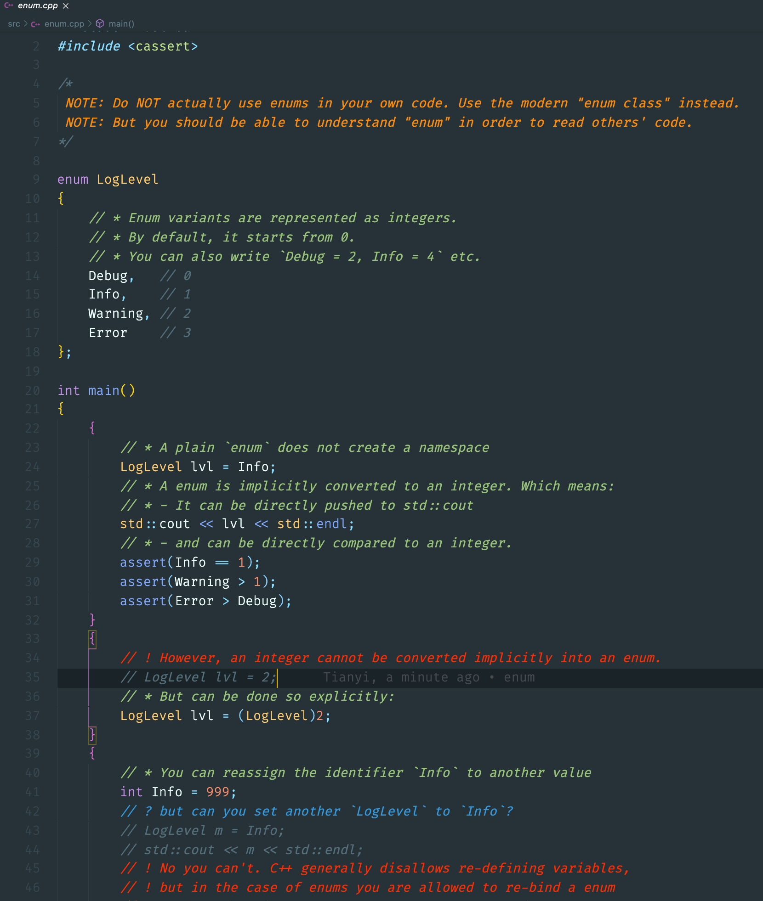

# C++ for Rustaceans

Navigate to https://tianyishi2001.github.io/cpp4r to read online. Alternatively, you can download the [PDF](https://tianyishi2001.github.io/cpp4r/cpp4r.pdf) or [epub](https://tianyishi2001.github.io/cpp4r/cpp4r.epub) formats.

The actual book is being developed on the [`docs` branch](https://github.com/TianyiShi2001/cpp4r/tree/docs), and the `main` branch contains only the C++ code.

# The Goal of this Project

Help Rustaceans read C++ code and translating them to Rust in order to make the world a better place.

# About the Code

I recommend reading the source code in Visual Studio Code with the [Better Comments](https://marketplace.visualstudio.com/items?itemName=aaron-bond.better-comments) extension, which makes comments *much* easier to follow along.

