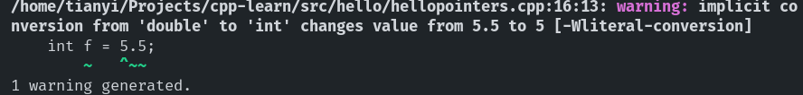

# Hello C++

In this chapter, we'll learn the very basics of C++.

## Hello world

This is a hello world program in C++:

```c++
#include <iostream>
int main()
{
    std::cout << "Hello C++!" << std::endl;
    return 0;
}
```

Write the above code in `hello.cpp`, then you can compile it with
`g++ hello.cpp -o hello` and run `./hello` (you can replace `g++` with `clang++`
or any other compiler).

A couple of things to note here:

Every C++ executable (as opposed to library) must have a `main()` function that
returns `int`. Returning `0` signifies that the program terminates without errors.
The final `return 0;` statement can be omitted in the `main()` function.

`#include` is a preprocessor. We'll meet more preprocessors in the future, for now
 just accept that they are "naive macros" that are "expanded" before the actual
 compilation.
Here `#include` copies the content of file called `iostream`, which has tens of
thousands lines, and pastes it here. Yes, it literally does so, and you can check
this by running `g++ -E main.c`, which "expands" all preprocessor statements.

`iostream` contains definitions of functions and objects such as `std::cout` and
`std::endl`, which are used for IO manipulations. `cout` stands for "character
output", and `endl` stands for "endline" (it appends `\n` and flushes the buffer).
`<<` is the bitwise left shift operator, and the designers of C++ decided that
overloading bitwise shift operators for `cout` and `cin` can make C++ look fancy
from the beginning. That's why we need to learn yet another special syntax.

Fortunately (or unfortunately), there's another way to do exactly the same thing:

```c++
printf("Hello from printf\n");
```

Now you might begin to wonder, why isn't `std::cout` called `std::iostream::cout`, and why `printf` can be called without any prefix. This is because in C++ filenames have no relationships to `namespace`s by default. `namespace` is similar to Rust's `mod`, but more flexible. In this case, the `iostream` file contains something conceptually like this:

```c++
void printf(...);

namespace std {
    class cout {}
    class endl {}
}
```

`printf` isn't placed inside `std` because it is a heritage from C. Many other C functions are also available in C++, and they can be distinguished by the absence of the `std::` prefix.

## Data Types

### Integer Types

The following table summarises the relationship between Rust's and C++'s integer data types:

|  Rust   |    C++     |     C & C++      |
| :-----: | :--------: | :--------------: |
|  `i8`   |  `int8_t`  |      `char`      |
|  `i16`  | `int16_t`  |     `short`      |
|  `i32`  | `int32_t`  |      `int`       |
|  `i64`  | `int64_t`  |      `long`      |
| `i128`  |            |                  |
|  `u8`   | `uint8_t`  | `unsigned char`  |
|  `u16`  | `uint16_t` | `unsigned short` |
|  `u32`  | `uint32_t` |  `unsigned int`  |
|  `u64`  | `uint64_t` | `unsigned long`  |
| `u128`  |            |                  |
| `isize` |            |                  |
| `usize` |  `size_t`  |                  |

While the equivalence between the first column and the second column always holds true, the third column depends on the platform and here I'm assuming you're on a modern, 64-bit system.

While the relationships described in the table are always true, C++'s integer types are much more complex. The types above are fixed width integer types, and there are additional integer types whose width is dependent on the implementation. These include C-compatible ones (i.e. `char`, `short`, `int`, `long`, `long long`), and other C++ artifects such as `int_fast16_t` and `int_least32_t`. You can learn about them at [cppreference](https://en.cppreference.com/w/cpp/types/integer).

### Floating Point Numbers

For floating numbers, `f32` and `f64` correspond to `float` and `double`, respectively (stand for single-precision and double-precision floating point numbers).

## Variables

Like in Rust, creating a variable requires two steps, declaration and initialization. In C++, there are usually more than one syntax to do any task, and these two basic operations are no exception.

The traditional syntax for declaration and initialization is `<type> <var name> = <value>;`, and these two steps can be separated:

```c++
int a = 5;
char b;
b = 'A';
```

The above syntax is compatible with C, which has a problem: if you initialize an `int` with a float:

```c++
int a = 5.5;
assert(a == 5);
```

The value will be implicitly converted. Instead of giving a warning or simply disallowing this (recent compilers DO give a warning; see Figure \@ref(fig:equal)), the designers of C++ decided to invent another syntax for declaration and initialization, using curly braces:

```c++
int a{5};
```

```{r equal, echo=FALSE,out_width="100%", fig.cap="When implicit conversion occurs, a decent modern C++ compiler will give a warning."}

```

If you try `int a{5.5};` with this syntax, the compiler will give an error and abort (Figure \@ref(fig:braces) ). In addition, you can't separate the two parts:

```c++
// not allowed
int a;
a{5}
```

```{r braces, echo=FALSE, out_width="100%", fig.cap="When implicit conversion occurs, a decent modern C++ compiler will give a warning."}

```

### Mutability

Variables are mutable by default. If you want to create an immutable variable, use the `const` keyword.

```rust
// Rust
let a = 5;
let mut b = 10;
```

is equivalent to

```c++
//C++
const auto a = 5;
auto b = 10;
```

If `const` is used to create an immutable variable, how to create a real "constant" that's evaluated at compile time? The answer is `consexpr`.

```rust
// Rust
const LIGHT_SPEED: f64 = 2.99792458e8;
```

is equivalent to

```c++
constexpr double LIGHT_SPEED = 2.99792458e8;
```

What about constant strings? Well, like Rust, you can't use the dynamically allocated `std::string`.

```rust
// Rust
const NAME: String = "Hideyo".to_string(); // not allowed!
const NAME: &'static str = "Hideyo";       // good
```

```c++
//C++
constexpr std::string NAME = "Hideyo"; // not allowed!
constexpr char NAME[] = "Hideyo";      // good
```

So you have to use an array of characters. Well, it's technically closer to `const NAME: &[u8] = b"Hideyo";`. Then, if you need to use the `std::string`, you need explicit conversion:

```c++
#include <iostream>

constexpr char NAME[] = "Hideyo";
constexpr char NAME_UTF8[] = "英世";

int main()
{
    const std::string NAME_STRING(NAME);
    const std::string NAME_UTF8_STRING(NAME_UTF8);
    // thank god UTF8 works! If you were in C you would have a hard time.
    std::cout << NAME_UTF8_STRING << " " << NAME_STRING << std::endl;
}
```


## Functions

Functions are declared and defined in the following way:

```
<return_type> <function_name>(<params>) {
    // do something
    return something;
}
```

For example:

```c++
#include <iostream>

float square(float a)
{
    return a * a;
}

int main()
{
    float x = 2.5;
    std::cout << "square of " << x << "is" << square(x) << std::endl;
}
```

Note that a function must be *declared* before it can be used. This means the following won't work:

```c++
#include <iostream>

// float square(float);

int main()
{
    float x = 2.5;
    std::cout << "square of " << x << "is" << square(x) << std::endl;
}


float square(float a)
{
    return a * a;
}
```

However, by uncommenting the third line, it works. When you use a function, the compiler must know the signature, but not necessarily the *definition* of the function. This is why in C++ (and in C) people split their funtions into signatures which go into header files, and definitions which go into `.cpp` files. This practice, coupled with C's macro system (inherited by C++), leads to many pitfalls and confusing situations.[^header-bad] In particular, it can be difficult to just find the definition of a function without a decent and properly configured IDE. I'll get back to header files later. For now we'll be working with single-file programs without splitting declaration and definitions.

[^header-bad]: https://softwareengineering.stackexchange.com/questions/180904/are-header-files-actually-good

## Pointers and References

Syntaxes related to pointers and references in C++ are...interesing.

In Rust, when you take a reference to a type `T`, the type of the reference is `&T`. The syntax can't be more natual: you add `&` to both LHS and RHS:

```rust
let   a:  i32 =  5;
let p_a: &i32 = &5; // type annotations are not required; this is just for demonstration
```

and when you deference, you use `*`. Just remembering that `*` is the reverse of `&`, everything is natual as well. Every `*` just removes one `&` from both LHS and RHS:

```rust
let p_a: &i32 = &5;
let   a:  i32 = *p_a;
let   a:  i32 = *&*&*&a
```

In C++, this is how you make a pointer:

```c++
int    a =  5;
int *p_a = &5;
// or
int * p_a = &5;
// or
int*  p_a = &5;
```

and to dereference a pointer:

```c++
int b = *p_a;
```

You add `&` to RHS, but you add `*` to LHS. Weird. What's worse, despite the fact that the variable name really is `p_a`, not `*p_a`, and the type really is `int*`, most people and formatters prepend the asterisk before the variable name, which looks like you're declaring an `int` which is clearly not true. So why are people doing that? There are some discussion on [StackOverflow](https://stackoverflow.com/questions/398395/why-is-the-asterisk-before-the-variable-name-rather-than-after-the-type).

<!-- To be consistent with this weird convention, tools will also name pointer types as `` `T *` `` (with a space in between), not `` `T*` ``. -->

But wait, how did people learn this weird convention in the first place? On [cppreference](https://en.cppreference.com/w/cpp/language/pointer), and in Bjarne Stroustrup's *A Tour of C++*, the `int* p_a = &5` style is always used, so just...why? Why are people sticking to the anti-standard?

Anyway, you can choose whichever form you like when you write your code, but you need to able to read all forms so that you can read others' code.

Since pointers are a heritage from C, it is not surprising that the *creative* C++ designers invented yet another similar syntax for achieving almost the same task: references. You create and read a reference like this:

```c++
int l = 5;
int& m = l;
assert(m == 5); // not `*m` !
```

Note that you can directly create a pointer, but not a reference to a literal, that is to say:

```c++
int* i = &5; // is valid
int& j = 5;  // is not allowed
```

You do not need to (and cannot) use the deference operator (`*`) on a reference to access the value of the referent. In addition, a reference cannot be re-assigned to refer to another value. Apart from these two rules, references are effectively the same as pointers. It can be helpful to see a reference as an *alias* to a *named variable*. Indeed, a reference shares the same memory address as its referent.

Since we are Rustaceans, we are sensitive to mutability. Are there any difference between pointers and references in terms of mutability? The answer is no. Both can be used to mutate the referent.

```c++
#include <iostream>
int main()
{
    int a{5};
    int &r_a = a;  // create a reference
    int *p_a = &a; // create a pointer
    printf("| a|r_a|*p_a|     p_a      |\n");
    a = 10; // mutate the value
    printf("|%d| %d|  %d|%p|\n", a, r_a, *p_a, p_a);
    r_a = 15; // mutate via reference; no asterisk!
    printf("|%d| %d|  %d|%p|\n", a, r_a, *p_a, p_a);
    *p_a = 20; // mutate via pointer
    printf("|%d| %d|  %d|%p|\n", a, r_a, *p_a, p_a);
}
```

```
| a|r_a|*p_a|     p_a      |
|10| 10|  10|0x7ffe09e40404|
|15| 15|  15|0x7ffe09e40404|
|20| 20|  20|0x7ffe09e40404|
```

## Control Flow

C++ offers 5 types of control flow statements. `if...else`, `for` loop and `while` loop are pretty much the same as in Rust, but the `switch` statement is much less powerful than Rust's `match`. Additionally there is a `goto` statement which performs unconditional jump and is notorious for leading to "unmaintainable spaghetti code" (however, people are still using them, and you'll see why in a minute).

If you have experience in Javascript or Java, most of C++'s control flow syntax will be familiar to you. The conditional test associated with `if`, `for`, `while` and `switch` must be surrounded by parentheses.

### `if...else`

Like Rust, C++ offers `if` and `else` keywords to work with conditionals. Unlike Rust, C++ is not expression-oriented, so you *cannot* write:

```c++
int a = if (true) { 5 } else { 10 };
```

But this kind of conditional assignment is a very common pattern, so C++ invented yet another syntax specifically designed for this single task: the ternary operator. So, instead of writing:

```c++
int a;
if (true) { a = 5; } else { a = 10; };
```

you could write:

```c++
int a = true ? 5 : 10;
```

### `while` Loop

The `while` loop in C++ has nothing different from Rust, just remember to wrap the test expression with parentheses.

```c++
#include <iostream>
int i = 10;
while (i > 0)
{
    i--;
    if (i == 8)
    {
        continue;
    }
    if (i == 5)
    {
        break;
    }
    std::cout << i << std::endl;
}
```

### `for` Loop

A traditional C-style `for` loop looks like this (you'll be familiar with this if you code Javascript or Java):

```
for (<initializationStatement>; <testExpression>; <updateStatement>)
{
    // do something
}
```

For example:

```c++
#include <iostream>
printf("|i|j|\n");
for (int i = 0; i < 2; i++)
{
    for (int j = 0; j < 3; j++)
    {
        printf("|%d|%d|\n", i, j);
    }
}
```


C++11 introduced the range-based `for` statement, which is also known as a `for...in` loop in most other languages (Rust, Swift, Python, Ruby, ...). The syntax itself is easy but knowing the relationship between the element and the iterable can be tricky. Fortuantely, we are Rustaceans, so an easy way for me to illustrate and for you to understand is to write a few equivalent examples in Rust and C++.

#### Scenario 1: Copying (Cloning)

```rust
// Rust
let v = vec!["a".to_string(), "b".to_string(), "c".to_string()];
for e.clone() in &v {
    println!("{}", e);
}
```

```c++
// C++
#include <iostream>
#include <vector>
std::vector<std::string> a{"a", "b", "c"};
for (auto s : a) // s has type `std::string`
{
    std::cout << s << std::endl;
}
```

Note how Rust makes it crystal clear that copying during iteration and using `String` for instead of `&str` for static strings are anti-patterns and how C++ makes it easy to write such inefficient code.

#### Scenario 2: As Reference (Borrowing)

```rust
// Rust
let v = vec![1, 2, 3, 4, 5];
for e in &v {
    println!("{}", *e);
}
```

```c++
// C++
#include <iostream>
#include <vector>
std::vector<int> a{1, 2, 3, 4, 5};
for (auto& num : a)
{
    printf("%d ", num); // no asterisk!
}
```

#### Scenario 3: Mutation

```rust
// Rust
let mut v = vec![1, 2, 3, 4, 5];
for e in &mut v {
    *e = e + 1;
}
assert_eq!(v, vec![2, 3, 4, 5, 6]);
```

```c++
// C++
#include <vector>
#include <cassert>
std::vector<int> a{1, 2, 3, 4, 5};
for (auto &num : a)
{
    num++;
}
assert(a == (std::vector<int>{2, 3, 4, 5, 6}));
```

Note the parentheses surrounding the second argument of `assert`, without which we would get an error. This is because `assert` is a so called `#define` macro, which simply parses its arguments as comma-separated identifiers and does text replacement. Since `std::vector<int>{2, 3, 4, 5, 6}` contains commas, it has to be escaped with parentheses.[^assert] This macro is actually defined in `assert.h` which is part of C's std, and its more or less copied verbatim into C++'s `cassert`. Theoretically I think it is possible to implement C++'s own `assert` or `#define` that removes the need for adding parentheses here and there. However, the C++ committee never cares about ergonomics.

[^assert]: Related to this stackoverflow question: https://stackoverflow.com/questions/38030048

<!-- ####

```rust
let v = vec![1, 2, 3, 4, 5];
for e in v {
    println!("{}", e);
}
``` -->


### `goto` Statement and Breaking outer Loops

Rust, like Java and Python, allows you to break an outer loop from an inner loop:

```rust
for i in 0..3 {
    'for_j: for j in 0..3 {
        for k in 0..3 {
            if i == 1 {
                break 'for_j;
            }
            println!("{} {} {}", i, j, k);
        }
    }
}
```

C++ doesn't support this natively, so people are using `goto` to achieve this:

```c++
#include <iostream>
printf("Break outer loop using goto:\n");
std::cout << "ijk " << std::endl;
for (int i = 0; i < 3; ++i)
{

    for (int j = 0; j < 3; ++j)
    {
        for (int k = 0; k < 3; ++k)
        {
            if (i == 1)
            {
                goto for_j_end;
            }
            std::cout << i << j << k << std::endl;
        }
    }
    for_j_end:
    {
    }
}
```

Using `goto` sounds like I am joking. I'm not. People really suggest doing this[^goto-break]. It's a consensus that `goto` statements are error-prone, but there really aren't better ways to do this when you absolutely need to break an outer loop. The C++ committee never solves really problems.

Alternatively you can use a flag, which is more verbose, and I think this is even less readable:

```c++
printf("Break outer loop using flag:\n");
std::cout << "ijk " << std::endl;
bool i_is_1{false};
for (int i = 0; i < 3; ++i)
{

    for (int j = 0; j < 3; ++j)
    {
        for (int k = 0; k < 3; ++k)
        {
            if (i == 1)
            {
                i_is_1 = true;
                break;
            }
            else
            {
                i_is_1 = false;
            }
            std::cout << i << j << k << std::endl;
        }
        if (i_is_1)
        {
            break;
        }
    }
}
```

There is another cleaner way, using the lambda trick (but why the hell should I use a lamba for such a basic task???):

```c++
printf("Break outer loop using lambda:\n");
std::cout << "ijk " << std::endl;
for (int i = 0; i < 3; ++i)
{
    [&] {
        for (int j = 0; j < 3; ++j)
        {
            for (int k = 0; k < 3; ++k)
            {
                if (i == 1)
                {
                    return;
                }
                std::cout << i << j << k << std::endl;
            }
        }
    }();
}
```

I'll get back to lamdas later. For now just accept that they are roughly equivalent to Rust's closures.

[^goto-break]: https://stackoverflow.com/questions/1257744/can-i-use-break-to-exit-multiple-nested-for-loops

### `switch`

C++'s `switch` is essentially a shortcut for a series of `if...else if...else if...else` statements. Well, often they are actually more *verbose* than the `if...else` chain.

The following C++ code

```c++
int d = 5;
if (d == 0) {
    printf("It's Sunday!\n");
} else if (d == 6) {
    printf("It's Saturday!\n");
} else {
    printf("It's weekday.\n");
}
```

is equivalent to:

```c++
switch (d)
{
case 0:
    printf("It's Sunday!\n");
    break;
case 6:
    printf("It's Saturday!\n");
    break;
default:
    printf("It's weekday.\n");
    break;
}
```

(I'll start to omit headers from now on.)

Note the `break` statement at the end of each `case`, without which the `default` branch will always be triggered, which is clearly not you meant to do. Oh, if the proper usage requires that `break;` needs to be appended to every case, why isn't the C++ language designed so that the `break`s happen implicitly[^fuck-switch]? Are there any `switch`- or `match`-like statements in other languages uglier than this? (Sorry there really is, that's [bash's `case` statement](https://linuxize.com/post/bash-case-statement/).)

[^fuck-switch]: We're not the only ones to spot this problem; see this [StackOverflow question](https://stackoverflow.com/questions/252489/why-was-the-switch-statement-designed-to-need-a-break). But if this is merely a design mistake in C and is inherited by C++, why don't Java and Javascript take the opportunity to break from this ugly semantics? (Stockholm syndrom, I know)

You can group several values into a single branch:

```c++
int d = 5;
switch (d)
{
case 0:
    printf("It's Sunday!\n");
    break;
case 6:
    printf("It's Saturday!\n");
    break;
case 1:
case 2:
case 3:
case 4:
case 5:
    printf("It's weekday.\n");
    break;
default:
    printf("Not a valid day of week!\n");
    break;
}
```

This is all about `switch` in C++. Forget everything about the fancy pattern matching in Rust!

## Exercise {-}

1. **Pointers and references.**

```c++
int x = 5;
int y = 10;
int* px = &x;
int* py = &y;
px = py;
// what are the values of x, y, *px and *py now?

int i = 5;
int j = 10;
int& ri = i;
int& rj = j;
ri = rj;
// what are the values of i, j, ri and rj now?
```